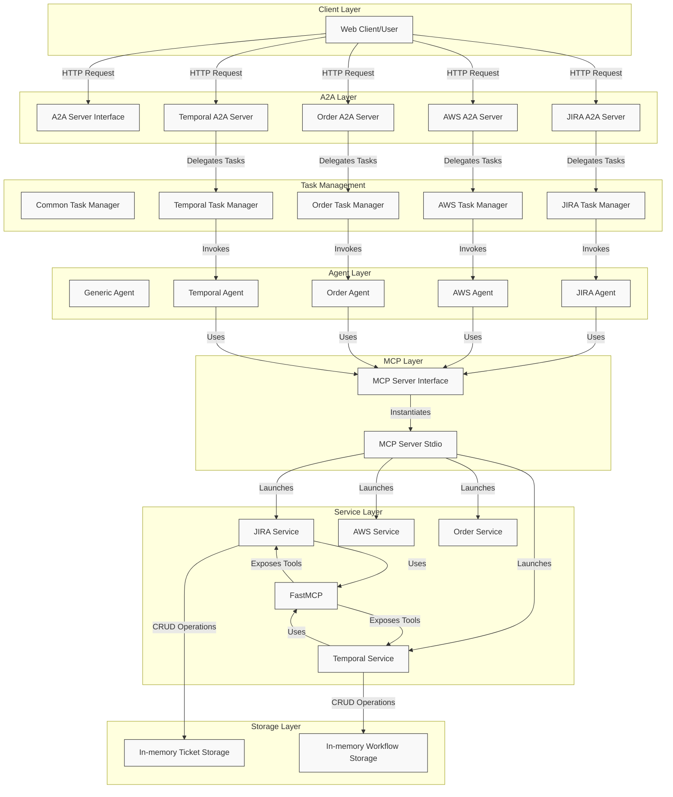

```mermaid
graph TB
    subgraph "Client Layer"
        Client[Web Client/User]
    end

    subgraph "A2A Layer"
        A2AServer[A2A Server Interface]
        JiraA2AServer[JIRA A2A Server]
        AwsA2AServer[AWS A2A Server]
        OrderA2AServer[Order A2A Server]
        TemporalA2AServer[Temporal A2A Server]
    end

    subgraph "Task Management"
        TaskManager[Common Task Manager]
        JiraTaskManager[JIRA Task Manager]
        AwsTaskManager[AWS Task Manager]
        OrderTaskManager[Order Task Manager]
        TemporalTaskManager[Temporal Task Manager]
    end

    subgraph "Agent Layer"
        Agent[Generic Agent]
        JiraAgent[JIRA Agent]
        AwsAgent[AWS Agent]
        OrderAgent[Order Agent]
        TemporalAgent[Temporal Agent]
    end

    subgraph "MCP Layer"
        MCPServer[MCP Server Interface]
        MCPServerStdio[MCP Server Stdio]
    end

    subgraph "Service Layer"
        FastMCP[FastMCP]
        JiraService[JIRA Service]
        AwsService[AWS Service]
        OrderService[Order Service]
        TemporalService[Temporal Service]
    end

    subgraph "Storage Layer"
        InMemoryTickets[In-memory Ticket Storage]
        InMemoryWorkflows[In-memory Workflow Storage]
    end

    %% Client to A2A connections
    Client -->|HTTP Request| A2AServer
    Client -->|HTTP Request| JiraA2AServer
    Client -->|HTTP Request| AwsA2AServer
    Client -->|HTTP Request| OrderA2AServer
    Client -->|HTTP Request| TemporalA2AServer

    %% A2A to Task Management connections
    JiraA2AServer -->|Delegates Tasks| JiraTaskManager
    AwsA2AServer -->|Delegates Tasks| AwsTaskManager
    OrderA2AServer -->|Delegates Tasks| OrderTaskManager
    TemporalA2AServer -->|Delegates Tasks| TemporalTaskManager

    %% Task Management to Agent connections
    JiraTaskManager -->|Invokes| JiraAgent
    AwsTaskManager -->|Invokes| AwsAgent
    OrderTaskManager -->|Invokes| OrderAgent
    TemporalTaskManager -->|Invokes| TemporalAgent

    %% Agent to MCP connections
    JiraAgent -->|Uses| MCPServer
    AwsAgent -->|Uses| MCPServer
    OrderAgent -->|Uses| MCPServer
    TemporalAgent -->|Uses| MCPServer

    %% MCP to Service connections
    MCPServer -->|Instantiates| MCPServerStdio
    MCPServerStdio -->|Launches| JiraService
    MCPServerStdio -->|Launches| AwsService
    MCPServerStdio -->|Launches| OrderService
    MCPServerStdio -->|Launches| TemporalService

    %% Service to Storage connections
    JiraService -->|Uses| FastMCP
    JiraService -->|CRUD Operations| InMemoryTickets
    TemporalService -->|Uses| FastMCP
    TemporalService -->|CRUD Operations| InMemoryWorkflows

    %% Additional connections
    FastMCP -->|Exposes Tools| JiraService
    FastMCP -->|Exposes Tools| TemporalService

    %% Descriptions
    class Client,A2AServer,JiraA2AServer,AwsA2AServer,OrderA2AServer,TemporalA2AServer,TaskManager,JiraTaskManager,AwsTaskManager,OrderTaskManager,TemporalTaskManager,Agent,JiraAgent,AwsAgent,OrderAgent,TemporalAgent,MCPServer,MCPServerStdio,FastMCP,JiraService,AwsService,OrderService,TemporalService,InMemoryTickets,InMemoryWorkflows node

    %% Style
    classDef node fill:#f9f9f9,stroke:#333,stroke-width:1px;
``` 